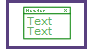
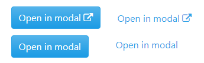
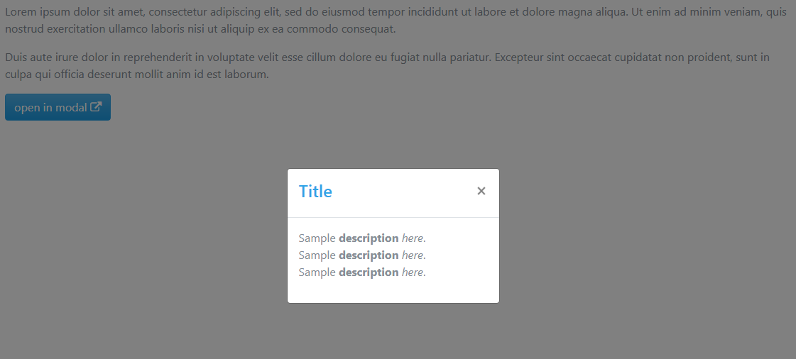
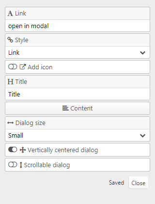

# [mh_Modal (mh Modal dialog)](https://github.com/mahotilo/CS.mh_Modal) - Bootstrap Modal dialog.
## Section type for CustomSections plugin (Typesetter CMS)

## About
The plugin adds section with link or button to open  Bootstrap Modal dialog with user defined content

## See also 
* [CustomSections](https://github.com/juek/CustomSections)
* [Typesetter on GitHub](https://github.com/Typesetter/Typesetter)
* [Typesetter Home](http://www.typesettercms.com)

## Current Version 
1.1

## Requirements
* Typesetter CMS
* CustomSections addon installed.
* Bootstrap 3 or 4 theme

## Manual Installation
1. Download the [master ZIP archive](https://github.com/mahotilo/CS.mh_Modal/archive/master.zip)
2. Upload the extracted folder '_types' to your server into the /addons/CustomSections-master/_types directory

## Demo
### Button

### Dialog

### Settings

## License
GPL 2, for bundled thirdparty components see the respective subdirectories.

## Changelog
* v1.1 
	- Add icon before button text
	- Style for iframe sizing in modal dialog
